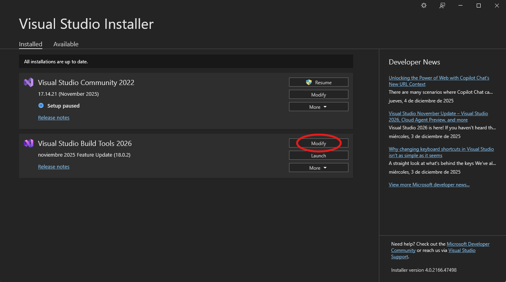
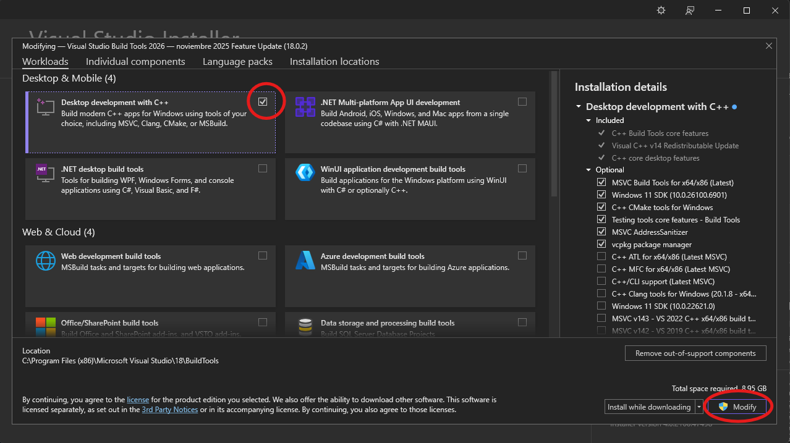

# TaurApp

TaurApp is a WhatsApp desktop client powered by [Tauri](https://tauri.app) and Rust.

TaurApp is an experimental client and is initially created to test out Tauri itself. So, it might lack some features and might be buggy at times.


## Installation

Go to [releases](https://github.com/mespp/taurapp/releases) and download or create the binary by yourself.

1. install necessary programs
   - install [github desktop](https://desktop.github.com/download) (or whatever git program you want)
   - install [rust](https://rustup.rs)
   - install [node.js](https://nodejs.org)
   - install [visual studio build tools 2026](https://aka.ms/vs/stable/vs_BuildTools.exe)
     * click on modify
        
     * select desktop development with C++ and click on modify
        
           
2. some more preparations
   - execute powershell as administrator
   - run ```Set-ExecutionPolicy RemoteSigned```

3. create the executable
   - clone the repo ```git clone https://github.com/mespp/taurapp-win```
   - get into the folder you cloned it with ```cd where_your_folder_is```
   - run ```npm install```
   - run ```npm run tauri build```

4. enjoy!
   - you'll have your .exe in ```directory_where_u_copied_the_repo\taurapp\src-tauri\target\release```
